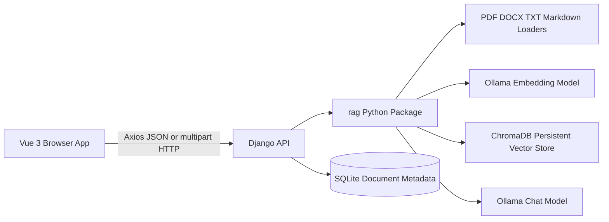
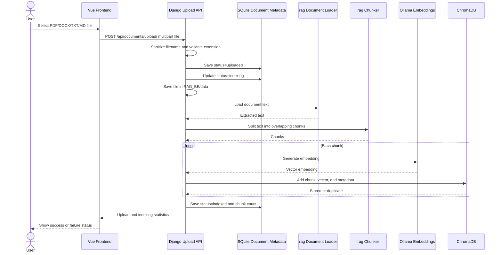
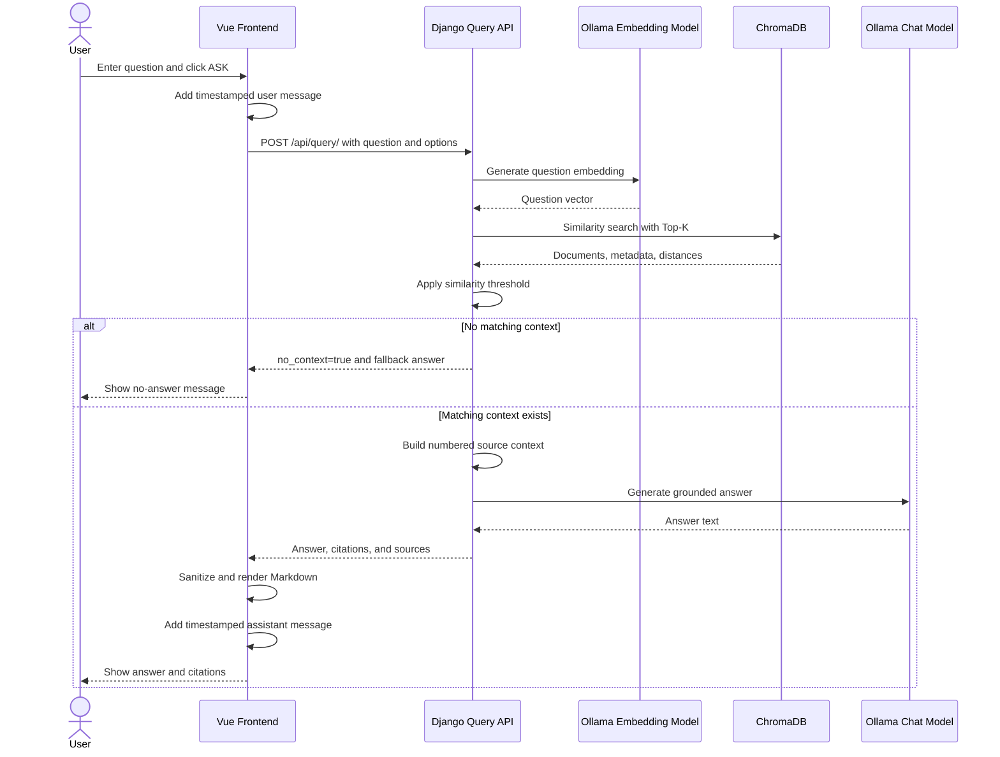
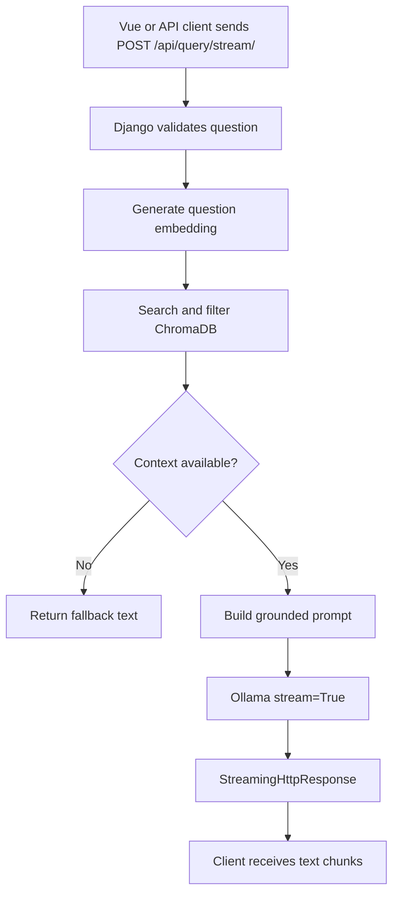

# RAG-Dcpl Technical Documentation

This document describes the implemented architecture and runtime flows of the RAG-Dcpl application.

## 1. System Overview

RAG-Dcpl is a local document question-answering application. The browser is built with Vue 3, the HTTP backend is Django, and the RAG engine is the existing Python `rag` package.



### Main services

| Component | Role | Location or service |
|---|---|---|
| Vue 3 + Vite | Browser interface and user interactions | `RAG-FE/` |
| Axios | HTTP client used by Vue | `RAG-FE/src/services/api.js` |
| Django | HTTP routing, validation, API responses, CORS | `RAG_BE/` |
| `rag` package | Loading, chunking, embedding, retrieval, prompting | `RAG_BE/rag/` |
| Ollama | Local embedding and chat inference | Local Ollama service |
| ChromaDB | Persistent vector similarity search | `RAG_BE/chroma_db/` |
| SQLite | Document metadata and lifecycle status | `RAG_BE/db.sqlite3` |

## 2. Frontend Technical Design

### Frontend entry points

- `src/main.js` creates and mounts the Vue application.
- `src/App.vue` renders the router view.
- `src/router/index.js` maps the home route to the RAG workspace.
- `src/views/HomeView.vue` contains the main RAG interface.
- `src/services/api.js` owns Axios calls to Django.
- `src/assets/base.css` defines design tokens and global styles.
- `src/assets/main.css` defines workspace layout and component styling.

### Frontend responsibilities

The frontend:

- Collects questions from the user.
- Sends questions to Django with Axios.
- Displays loading, success, and error states.
- Maintains browser conversation history.
- Displays timestamped user and assistant messages.
- Renders assistant Markdown through `marked` and sanitizes it with `DOMPurify`.
- Displays numbered source citations and expandable source content.
- Copies an answer to the clipboard.
- Clears the current conversation.
- Uploads supported documents.
- Refreshes the complete index.
- Lists indexed documents and status.
- Re-indexes a document.
- Requests confirmation before deleting a document.

### Frontend state

| State | Purpose |
|---|---|
| `question` | Current input value |
| `answer` | Most recent assistant answer |
| `sources` | Sources for the most recent answer |
| `conversation` | Browser-only message history |
| `isAsking` | Prevents duplicate query submissions and shows loading |
| `isUploading` | Controls upload state |
| `isIngesting` | Controls full-index refresh state |
| `documents` | Indexed document inventory |
| `documentAction` | Current re-index or delete operation |
| `error` | Visible error message |
| `ingestMessage` | Visible upload or indexing result |
| `copied` | Copy-answer feedback state |

## 3. Backend Technical Design

### Django configuration

Django is configured with:

- The `api` application.
- `django-cors-headers`.
- SQLite database.
- CORS origins for local Vite development and preview ports.
- API routes under `/api/`.

Django is the web boundary. It does not duplicate the RAG logic; views call the existing `rag` package.

### API routes

| Method | Route | Purpose |
|---|---|---|
| `POST` | `/api/query/` | Retrieve context and generate an answer |
| `POST` | `/api/query/stream/` | Optional streamed answer response |
| `POST` | `/api/ingest/` | Ingest all supported files in `RAG_BE/data` |
| `POST` | `/api/documents/upload/` | Save and ingest one uploaded file |
| `GET` | `/api/documents/` | List indexed documents and status |
| `POST` | `/api/documents/<filename>/` | Re-index one document |
| `DELETE` | `/api/documents/<filename>/` | Delete one document and its vector chunks |

### Query request

```http
POST /api/query/
Content-Type: application/json
```

```json
{
  "question": "What is chunking?",
  "top_k": 3,
  "similarity_threshold": 0.9
}
```

`top_k` and `similarity_threshold` are optional. If omitted, the backend uses configuration defaults.

### Query response

```json
{
  "question": "What is chunking?",
  "answer": "Chunking divides a large document into smaller pieces...",
  "sources": [
    {
      "citation": 1,
      "source": "Understanding the Retrieval-Augmented Generation (RAG) Pipeline.pdf",
      "chunk_index": 7,
      "distance": 0.542,
      "content": "..."
    }
  ],
  "no_context": false
}
```

When no retrieved chunk passes the similarity threshold:

```json
{
  "question": "...",
  "answer": "I could not find the answer in the provided documents.",
  "sources": [],
  "no_context": true
}
```

### Upload request

```http
POST /api/documents/upload/
Content-Type: multipart/form-data
```

The multipart field is named `file`.

Supported extensions:

- `.pdf`
- `.docx`
- `.txt`
- `.md`

The upload response includes the filename, files processed, chunks found, chunks stored, chunks skipped, and database total.

### Document status

Document metadata is stored in the Django `Document` model in SQLite.

```text
uploaded -> indexing -> indexed
                    \-> failed
```

Stored metadata includes:

- Filename
- Status
- Chunk count
- Error message
- Created timestamp
- Updated timestamp

## 4. RAG Package Design

### `config.py`

Central configuration includes:

- Project paths.
- `DATA_DIR`.
- `CHROMA_DB_DIR`.
- Chat model name.
- Embedding model name.
- Chunk size and overlap.
- Collection name.
- Default Top-K.
- Similarity threshold.

Environment overrides:

```text
RAG_TOP_K_RESULTS=3
RAG_SIMILARITY_THRESHOLD=0.9
```

### `document_loader.py`

Loads supported document formats into text:

- TXT and Markdown use UTF-8 text reading.
- PDF uses `pypdf`.
- DOCX uses `python-docx`.

### `chunker.py`

Splits text into overlapping character-based chunks.

Current defaults:

```text
chunk size: 500 characters
overlap: 100 characters
```

Overlap preserves context when a sentence crosses a chunk boundary.

### `embeddings.py`

Calls Ollama with the configured embedding model:

```text
nomic-embed-text
```

The resulting vector is stored with each chunk.

### `vectordb.py`

Wraps ChromaDB operations:

- Add a chunk.
- Skip an existing chunk ID.
- Search by embedding.
- Filter results by distance threshold.
- Count chunks.
- List source documents.
- Delete all chunks for a source.

Lower ChromaDB distance represents a closer match. Results with distance greater than the configured threshold are removed.

### `ingest.py`

The ingestion pipeline:

1. Select supported files.
2. Load document text.
3. Split text into chunks.
4. Generate an embedding for each chunk.
5. Create a stable chunk ID.
6. Store the chunk and metadata in ChromaDB.
7. Skip duplicate chunk IDs.

### `query.py`

The query pipeline:

1. Receive a question.
2. Generate a question embedding.
3. Search ChromaDB.
4. Apply Top-K and similarity threshold settings.
5. Build a context containing numbered citations.
6. Build a grounded prompt.
7. Generate the answer with Ollama.

### `llm.py`

Provides:

- Normal complete-answer generation.
- Optional streaming answer generation using Ollama's streaming API.

## 5. Document Upload and Ingestion Flow



### Full refresh ingestion

The **Refresh index** action calls `POST /api/ingest/`. That operation scans every supported file in `RAG_BE/data`. Stable chunk IDs make the operation idempotent: previously indexed chunks are skipped.

## 6. User Question Flow



## 7. Optional Streaming Flow



The current Vue workspace uses the normal `/api/query/` endpoint. The streaming route is available for a future streaming UI.

## 8. Error and Empty-State Behavior

| Situation | Backend behavior | Frontend behavior |
|---|---|---|
| Empty question | `400` response | ASK remains disabled |
| Invalid JSON | `400` response | Shows error message |
| Unsupported upload type | `400` response | Shows upload error |
| RAG pipeline failure | `500` response | Shows error message |
| Empty vector store | No-context fallback | Shows no-answer state |
| Similarity threshold excludes all chunks | `no_context: true` | Shows no-answer state |
| Backend unavailable | Axios failure | Shows error notice |
| Duplicate chunk | Skipped by ChromaDB | Shows skipped count |

## 9. Local Runtime

### Required services

1. Ollama must be running locally.
2. `phi3` must be available for chat generation.
3. `nomic-embed-text` must be available for embeddings.
4. Django must run on port `8000`.
5. Vue/Vite must run on port `5173` or another configured local port.

### Start backend

```powershell
cd D:\python-projects\RAG-dcpl\RAG_BE
.\.venv\Scripts\python.exe manage.py check
.\.venv\Scripts\python.exe manage.py runserver
```

### Start frontend

```powershell
cd D:\python-projects\RAG-dcpl\RAG-FE
npm run dev
```

### CLI ingestion

```powershell
cd D:\python-projects\RAG-dcpl\RAG_BE
.\.venv\Scripts\python.exe -m rag.ingest
```

### CLI query

```powershell
.\.venv\Scripts\python.exe -m rag.query
```

## 10. Verification Commands

Backend:

```powershell
.\.venv\Scripts\python.exe manage.py check
.\.venv\Scripts\python.exe manage.py test api
.\.venv\Scripts\python.exe -m compileall -q rag api ollama_RAG_BE
.\.venv\Scripts\python.exe -m pip check
```

Frontend:

```powershell
npm run build
npm run lint
npx cypress run --e2e
```

## 11. Current Implementation Boundary

Implemented now:

- Local CLI RAG pipeline.
- Django query and ingestion APIs.
- Browser question answering.
- Browser upload and ingestion.
- Document listing, re-indexing, and deletion.
- SQLite document status metadata.
- Conversation history and reset.
- Safe Markdown rendering.
- Source citations.
- No-context handling.
- Configurable retrieval.
- Optional streaming API.
- Copy-answer behavior.
- Timestamped messages.

Still remaining or needing broader coverage:

- Full automated backend test coverage for every RAG module.
- Full Vue component test coverage.
- Cypress coverage for query, upload, empty input, and backend failure.
- Upload size limits.
- Production secrets and environment configuration.
- Authentication if multiple users are required.
- Production deployment and backup procedures.

For the task checklist and milestone status, see [RAG_IMPLEMENTATION.md](RAG_IMPLEMENTATION.md).
